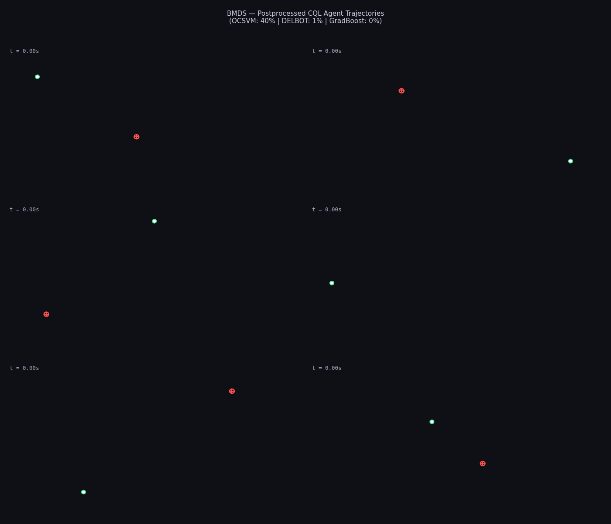

# reinforce-cursor

Offline reinforcement learning agent that synthesizes human-like mouse cursor trajectories, trained on real user telemetry inside a MuJoCo physics simulation. Evaluated under adversarial classification with 18 kinematic features.

## Method

1. **Data**: 45,775 mouse trajectories from the Balabit Mouse Dynamics Challenge (10 users)
2. **Environment**: MuJoCo 3.x rigid-body simulation — 2D force-controlled mouse on a desk surface
3. **Training**: Implicit Q-Learning (IQL) via d3rlpy on offline dataset with biomechanical reward shaping
4. **Evaluation**: 4 detectors — DELBOT RNN, GradientBoosting (Human vs synthetic bots), One-Class SVM (18 kinematic features), Adversarial GradBoost (Human vs Agent)

### Reward Design

- **Reach shaping**: distance penalty + exponential approach bonus (3·exp(-d/0.015))
- **Velocity damping**: penalizes motion near target to prevent oscillation
- **Fitts' Law speed shaping**: per-step penalty for deviating from Fitts-predicted progress curve
- **Kinematic constraints**: acceleration/jerk penalties, effort cost, velocity band matching
- **Episode rewards**: Fitts compliance, velocity profile correlation, path efficiency, submovement count

### Evaluation Protocol

Detection rates are reported per source (Human, Agent, Linear Bot, Bezier Bot) across 4 detectors with multi-seed validation and k-fold cross-validation.

## Repository Layout

- `bmds/` — core package (data, environment, reward, training, utilities)
- `scripts/` — evaluation and visualization (05–12)
- `run_training.py` — end-to-end pipeline (download → dataset → train → evaluate)

## Setup

```bash
python -m venv .venv
.venv\Scripts\activate
pip install -r requirements.txt
npm install
```

## Quick Start

Full pipeline:

```bash
python run_training.py
```

Train IQL on existing dataset:

```bash
python run_training.py --skip-download --skip-dataset-build --algorithm iql --steps 100000
```

Run the 4-detector gauntlet:

```bash
python scripts/11_multi_detector_gauntlet.py --n-movements 100 --seed 42
```

## Dependencies

MuJoCo 3.x, d3rlpy 1.1.x, PyTorch, Gymnasium, scikit-learn, NumPy, SciPy, Node.js (DELBOT RNN)

## References

- Fitts, P. M. (1954). The information capacity of the human motor system. *J. Exp. Psych.*, 47(6).
- Flash, T. & Hogan, N. (1985). The coordination of arm movements. *J. Neuroscience*, 5(7).
- Balabit Mouse Dynamics Challenge (2016). github.com/balabit/Mouse-Dynamics-Challenge
- Seno, T. & Imai, M. (2022). d3rlpy: An offline deep RL library. *JMLR*, 23(315).
