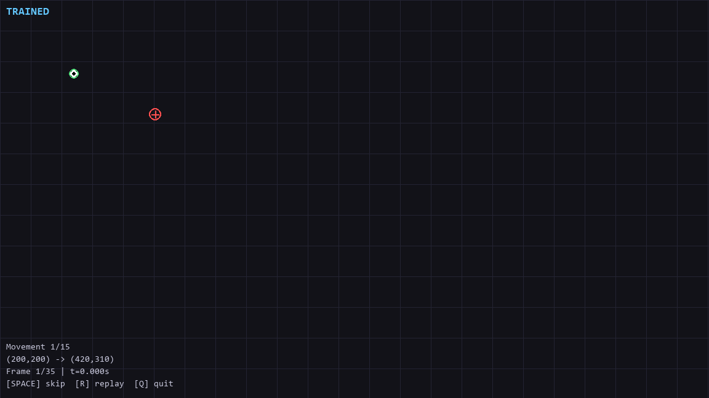

# BMDS (Biomechanical Mouse Dynamics Synthesizer)

BMDS is a full pipeline for synthetic mouse dynamics.

It includes telemetry ingestion, trajectory segmentation, kinematic feature extraction, physics-constrained simulation, offline reinforcement learning policy training, and quantitative evaluation.

Training is grounded in real user telemetry from the Balabit Mouse Dynamics Challenge, and policy learning is performed with offline RL methods.


The output is synthetic mouse trajectories as `(x, y, timestamp)` sequences constrained by measured human movement statistics.

## Repository Layout

- `bmds/`: core package (data processing, environment, reward, training, utilities)
- `scripts/`: evaluation and live visualization scripts
- `run_training.py`: end-to-end pipeline entry point
- `data/`: raw and processed datasets (gitignored)
- `models/`: saved model files (gitignored)
- `output/`: visualizations and logs

## Setup

```bash
python -m venv .venv
.venv\Scripts\activate
pip install -r requirements.txt
```

## Quick Start

Run the full pipeline:

```bash
python run_training.py
```

Run a shorter experiment:

```bash
python run_training.py --steps 5000 --max-trajectories 500
```

Generate trajectories from a trained model:

```bash
python scripts/06_generate_trajectories.py --start 100 100 --end 800 500 --plot
```

Open live viewers:

```bash
python scripts/07_live_mujoco_viewer.py
python scripts/08_live_screen_animation.py
```

## Notes

- Main dependencies include MuJoCo, MyoSuite, PyTorch, Gymnasium, and d3rlpy.
- TensorBoard logs are written under `output/tensorboard/` when training runs.
